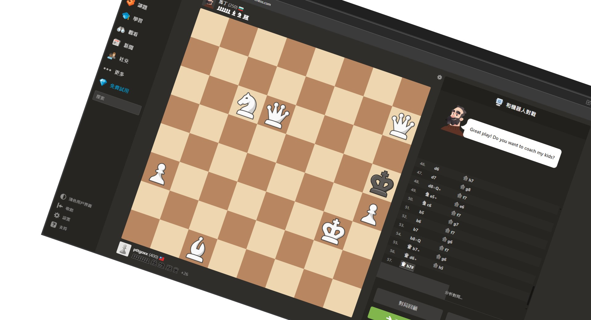
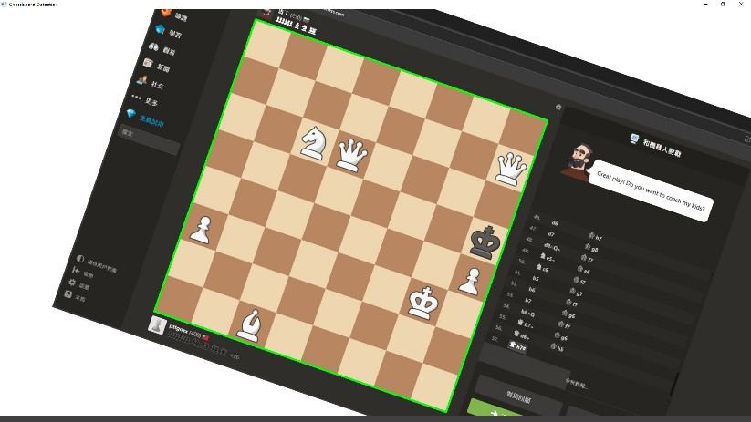
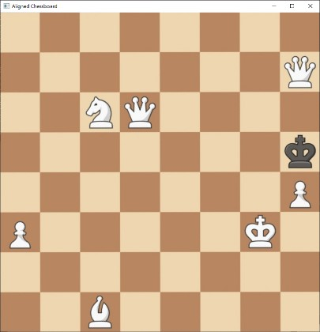
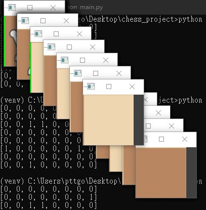
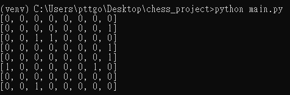

# Chessboard Detection Project

## Overview
This project demonstrates a computer vision system for detecting chessboards and chess pieces using OpenCV. The system processes input images, detects the chessboard and pieces, and outputs their positions on an 8x8 grid. It is designed to handle variations in angles and lighting.

---

## Features
- **Chessboard Detection**:
  - Identifies and aligns chessboards using contour detection and perspective transformation.
- **Chess Piece Detection**:
  - Detects pieces in each grid using edge detection, color thresholding, and other visual cues.
- **Grid Visualization**:
  - Displays each grid cell for detailed inspection.
- **Aligned Chessboard**:
  - Showcases a corrected chessboard after perspective transformation.
- **Robust Performance**:
  - Works under varying lighting conditions and angles.

---

## Requirements

To set up the environment, use the provided `requirements.txt` file, which includes all necessary dependencies. Ensure you have Python 3.8 or higher installed.

Install the dependencies with:
```bash
pip install -r requirements.txt
```

---

## Installation

1. Clone this repository:
   ```bash
   git clone https://github.com/yourusername/Chessboard_Detection_Project.git
   ```
2. Navigate to the project directory:
   ```bash
   cd Chessboard_Detection_Project
   ```
3. Install dependencies:
   ```bash
   pip install -r requirements.txt
   ```
---

## Usage
1. Place your input images in the `images/` folder.
2. Run the program:
   ```bash
   python main.py
   ```
3. The output will include:
   - Visualizations of the input image, detected chessboard, aligned chessboard, and grid cells.
   - A printed 8x8 grid representing the positions of pieces.

---

## Directory Structure
```
Chessboard_Detection_Project/
├── images/         # Folder for input images
│   ├── chessboard1.jpg
│   ├── chessboard2.jpg
│    ...
│    ...
│    
├── main.py         # Main program file
├── README.md       # Project description and usage instructions
```

---

## Results
- **Example Detection**:
  - Input Image:
    
  - Chessboard Detection:
    
  - Aligned Chessboard:
    
  - Grid Cell Example:
    
  - Result:
    
  - terminal output:
    

---

## References
1. Official OpenCV Documentation: [https://docs.opencv.org](https://docs.opencv.org)  
2. Masouris, Athanasios, and Jan van Gemert. *End-to-End Chess Recognition.*  
   Available at: [https://arxiv.org/abs/2310.04086](https://arxiv.org/abs/2310.04086)  
3. Wölflein, Georg, and Ognjen Arandjelović. *Determining Chess Game State from an Image.*  
   Available at: [https://arxiv.org/abs/2104.14963](https://arxiv.org/abs/2104.14963)
   
---

## License
This project is licensed under the MIT License - see the [LICENSE](LICENSE) file for details.

