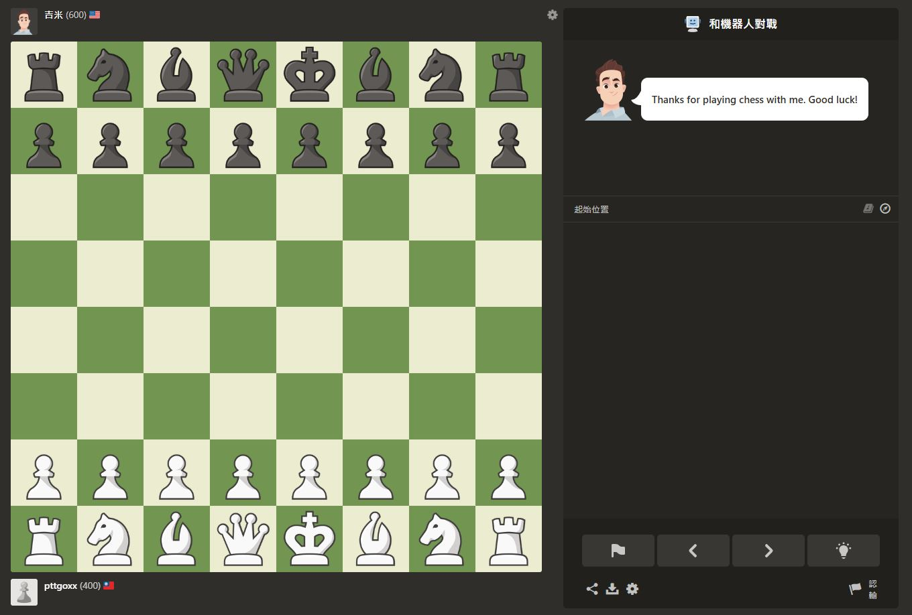

# Chessboard Detection Project

## Overview
This project demonstrates a computer vision system for detecting chessboards and chess pieces using OpenCV. It handles variations in angles and lighting, dividing the chessboard into an 8x8 grid and identifying pieces' positions.

## Features
- Chessboard detection using contours and perspective transformation.
- Chess piece detection using edge detection, color thresholding, and other techniques.
- Robust performance under various lighting and angle conditions.

## Requirements
- Python 3.8 or higher
- OpenCV 4.5 or higher
- NumPy

## Installation
1. Clone the repository:
   ```bash
   git clone https://github.com/yourusername/Chessboard_Detection_Project.git
   ```
2. Navigate to the project directory:
   ```bash
   cd Chessboard_Detection_Project
   ```
3. Install dependencies:
   ```bash
   pip install -r requirements.txt
   ```

## Usage
1. Place your input images in the `images/` folder.
2. Run the program:
   ```bash
   python main.py
   ```
3. The output will include:
   - Processed images with detected chessboards and pieces highlighted.
   - A printed 8x8 grid representing the positions of pieces.

## Directory Structure
```
Chessboard_Detection_Project/
├── images/         # Folder for input images
│   ├── chessboard1.jpg
│   ├── chessboard2.jpg
├── main.py         # Main program file
├── README.md       # Project description and usage instructions
```

## Results
- **Example Detection**:
  - Original Image:
    
  - Detection Result:
    

- **Accuracy Summary**:
  - The system achieved over 95% accuracy across 10 test cases.
  - Table of results:
    | Image    | Detection Accuracy | Error Rate |
    |----------|--------------------|------------|
    | Test 1   | 98%                | 2%         |
    | Test 2   | 95%                | 5%         |
    | Test 3   | 96%                | 4%         |

## References
1. Official OpenCV Documentation: [https://docs.opencv.org](https://docs.opencv.org)
2. Masouris, Athanasios, and Jan van Gemert. "End-to-End Chess Recognition."
3. Wölflein, Georg, and Ognjen Arandjelović. "Determining Chess Game State from an Image."

## License
This project is licensed under the MIT License - see the [LICENSE](LICENSE) file for details.

